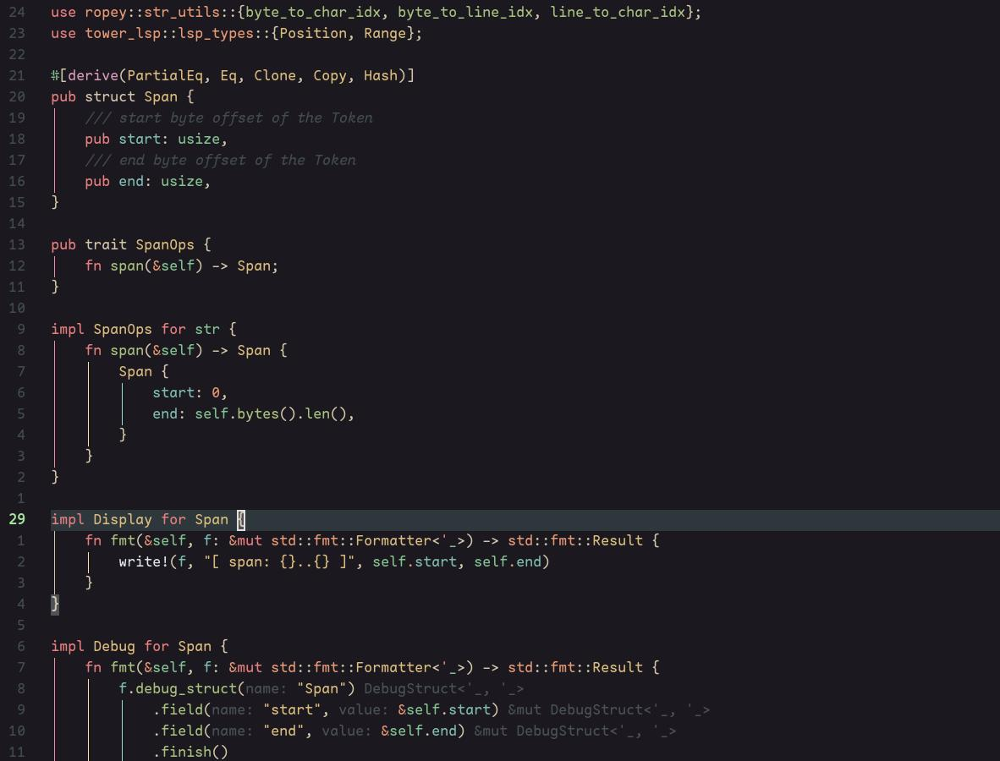

# Monet.nvim

A dark theme for Neovim inspired by Monet's paintings with a soothing color palette.

## Screenshots

 

## Installation

### Using Packer

```lua
use 'abhinandh-s/monet.nvim'
```

### Using Lazy.nvim

```lua
{
    'abhinandh-s/monet.nvim',
    lazy = false,
    priority = 1000,
    config = function()
      vim.cmd("colorscheme monet")
    end,
}
```

### Using vim-plug

```vim
Plug 'abhinandh-s/monet.nvim'
```

## Usage

```vim
" VimScript
colorscheme monet
```

```lua
-- Lua
vim.cmd.colorscheme 'monet'
```

## License

MIT
